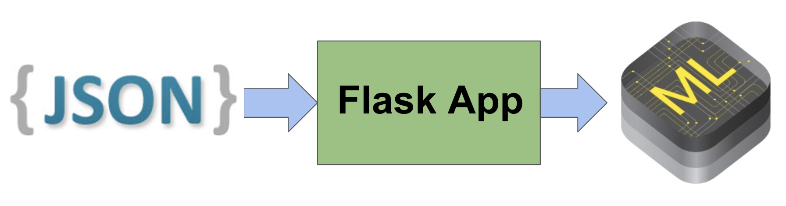
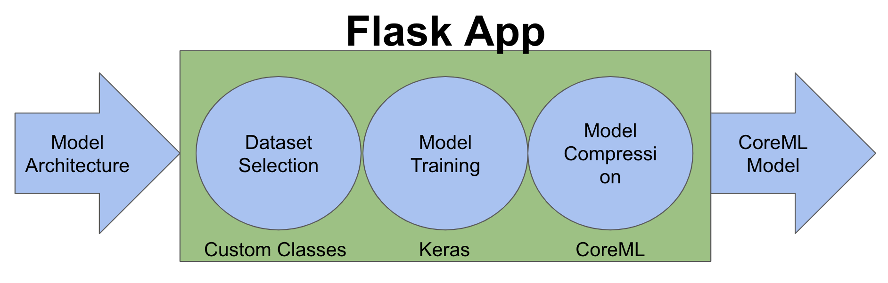
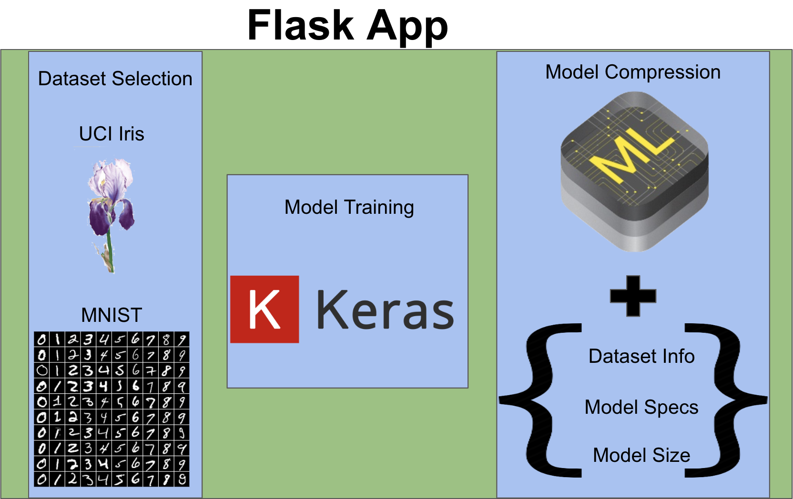

# SculptML Flask App

This repo contains the code necessary to run the Flask server that handles the SculptML iOS app's HTTP requests.

## Summary
The application takes in a JSON full of model & dataset info, and returns a JSON containing an Apple CoreML model along with corresponding meta information. 

## Flask Overview

We used Flask to support a RESTful API that wraps 3 distinct stages of the backend. Our first stage parses the request for dataset info, then constructs and trains a model from the model specifications via Keras, and finally compresses the trained model using Apple's CoreML.

## Backend Internals

We currently support 2 classification datasets: 
* The UC Irvine Iris dataset which has 4 features describing different Iris species and 
* The MNIST dataset of handwritten white digits on blackboard (28x28 pixels, grayscale)

And we return JSON containing the CoreML binary as well as additional information that the iOS app uses to use and store the model.

# Running the Code
To run the code, create a virtual environment called `sculptml-venv` in the `sculptml-flask-app` directory, and `pip install -r sculptml-flask-app/requirements`. 

Then you can activate the virtual environment with `source activate sculptml-flask-app/sculptml-venv/bin/activate`. Finally, from the `sculptml-flask-app` folder, you can run a test of the backend on a input query JSON with `python main.py INPUT_QUERY.json`. If everything works properly, you should see your json copied to `user_request.json` and the `saved-models/` directory appear, with a CoreML model and Keras weights of your trained model. Note that this application works best if your server/computer actually has GPU support for Tensorflow/Keras (requires `pip install tensorflow-gpu`).
